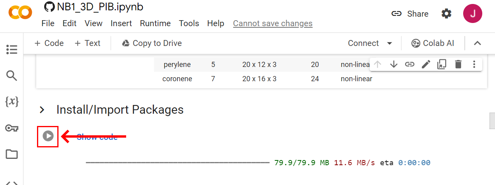

.. _short-guide: 

Running the Code
================

Colab Notebook Code Blocks
--------------------------
In order to run the code in the cloud using Colab, you'll need to first connect to a runtime. You can connect by either (1) clicking the |connect| button in the upper right or (2) trying to run any cell by clicking the |arrow| button alongside it:

----

Once the green checkmark appears |checkmark| , the code blocks can be executed or pressing SHIFT+ENTER. 

.. image:: figures/wavefunction_anim.gif

.. note::
   The GUI widgets become active only after executing the cell.

Viewing the Code
----------------
If you would like to view the source code, click the |show-code| button near the top of any cell to reveal the Python code behind each animation:

Saving Changes
--------------
Keep in mind that any cloud files created or changes made to the source code are lost when the runtime is disconnected. If you would like save your work, save a copy to your Google Drive account with the |drive-copy| button on the top menu (alternatively File -> Save a copy in Drive).

